# <div align="center">🌟 **GOKUL G H** 🌟</div>

<div align="center">
  
```ascii
╔══════════════════════════════════════════════════════════════╗
║  ██████╗  ██████╗ ██╗  ██╗██╗   ██╗██╗         ██████╗ ██╗   ██╗║
║ ██╔════╝ ██╔═══██╗██║ ██╔╝██║   ██║██║        ██╔════╝ ██║   ██║║
║ ██║  ███╗██║   ██║█████╔╝ ██║   ██║██║        ██║  ███╗███████║║
║ ██║   ██║██║   ██║██╔═██╗ ██║   ██║██║        ██║   ██║██╔══██║║
║ ╚██████╔╝╚██████╔╝██║  ██╗╚██████╔╝███████╗   ╚██████╔╝██║  ██║║
║  ╚═════╝  ╚═════╝ ╚═╝  ╚═╝ ╚═════╝ ╚══════╝    ╚═════╝ ╚═╝  ╚═╝║
╚══════════════════════════════════════════════════════════════╝
```

  <h3>
    
  </h3>

  <p align="center">
    
    
    
  </p>

</div>

---

<div align="center">

## 🌈 **CONNECT WITH ME** 🌈

<table>
<tr>
<td align="center" width="33%">
  <a href="tel:+917975004416">
    
  </a>
</td>
<td align="center" width="33%">
  <a href="mailto:gokul.gh2005@gmail.com">
    
  </a>
</td>
<td align="center" width="33%">
  <a href="https://www.linkedin.com/in/gokul-g-h-ba3a38254/">
    
  </a>
</td>
</tr>
</table>

</div>

---

<div align="center">

# 🚀 **ABOUT THE DEVELOPER** 🚀

</div>

<table>
<tr>
<td width="50%">

```typescript
interface Developer {
  name: string;
  role: string[];
  education: string;
  location: string;
  passion: string[];
  mindset: string;
}

const gokul: Developer = {
  name: "Gokul G H",
  role: [
    "Software Developer",
    "AI Enthusiast", 
    "Problem Solver",
    "Tech Innovator"
  ],
  education: "BCA @ The National College",
  location: "Bengaluru, Karnataka 🇮🇳",
  passion: [
    "Artificial Intelligence",
    "Web Development", 
    "Team Collaboration",
    "Continuous Learning"
  ],
  mindset: "Quick learner with growth mindset"
};
```

</td>
<td width="50%">

<div align="center">

### 🎯 **CAREER OBJECTIVE**

> *"I am a dedicated BCA student with a deep understanding of computer applications, programming languages, and technical concepts. I thrive in collaborative environments and am passionate about applying cutting-edge technology to solve real-world challenges."*

<br>

### 🌟 **CORE VALUES**
- 🔥 **Innovation-Driven**
- 🤝 **Team Collaboration** 
- 📈 **Continuous Growth**
- 💡 **Problem-Solving**
- 🎓 **Knowledge Sharing**

</div>

</td>
</tr>
</table>

---

<div align="center">

# 💻 **TECHNICAL ARSENAL** 💻

</div>

## 🔥 **Programming Languages**

<div align="center">

<table>
<tr>
<td align="center" width="20%">
  
  <br><strong>C++</strong>
  <br><sub>Object-Oriented Programming</sub>
</td>
<td align="center" width="20%">
  
  <br><strong>C#</strong>
  <br><sub>.NET Development</sub>
</td>
<td align="center" width="20%">
  
  <br><strong>Java</strong>
  <br><sub>Enterprise Applications</sub>
</td>
<td align="center" width="20%">
  
  <br><strong>Python</strong>
  <br><sub>AI/ML & Automation</sub>
</td>
<td align="center" width="20%">
  
  <br><strong>HTML5</strong>
  <br><sub>Web Structure</sub>
</td>
</tr>
</table>

</div>

## 🗄️ **Database & Backend Technologies**

<div align="center">

<table>
<tr>
<td align="center" width="25%">
  
  <br><strong>SQL Server</strong>
  <br><sub>Database Management</sub>
</td>
<td align="center" width="25%">
  
  <br><strong>MySQL</strong>
  <br><sub>Relational Databases</sub>
</td>
<td align="center" width="25%">
  
  <br><strong>DBMS</strong>
  <br><sub>Database Design</sub>
</td>
<td align="center" width="25%">
  
  <br><strong>Networks</strong>
  <br><sub>System Architecture</sub>
</td>
</tr>
</table>

</div>

## 🧠 **Core Computer Science Concepts**

```mermaid
mindmap
  root((💡 CS Core))
    🔧 Data Structures
      Arrays & Lists
      Trees & Graphs
      Hash Tables
      Stacks & Queues
    🧮 Algorithms
      Sorting & Searching
      Dynamic Programming
      Graph Algorithms
      Optimization
    🗄️ Database Systems
      SQL Queries
      Normalization
      Indexing
      Transactions
    🌐 Web Development
      Frontend Design
      Backend Logic
      API Integration
      Responsive Design
```

<div align="center">



</div>

## 🎯 **Professional Skills Matrix**

<div align="center">

<table>
<tr>
<td width="50%">

### 💻 **Technical Expertise**
```yaml
Programming:
  - Object-Oriented Programming: ████████████ 90%
  - Database Management: ██████████ 85%
  - Web Development: ████████ 80%
  - Problem Solving: ████████████ 95%
  - Data Structures: ██████████ 85%

Tools & Software:
  - Microsoft Office: ████████████ 90%
  - Development IDEs: ████████ 80%
  - Version Control: ██████ 70%
```

</td>
<td width="50%">

### 🤝 **Soft Skills**
```yaml
Interpersonal:
  - Team Collaboration: ████████████ 95%
  - Communication: ██████████ 85%
  - Leadership: ████████ 80%
  - Adaptability: ████████████ 90%
  - Creativity: ██████████ 85%

Personal:
  - Quick Learning: ████████████ 95%
  - Time Management: ██████████ 85%
  - Critical Thinking: ████████████ 90%
  - Innovation: ██████████ 85%
```

</td>
</tr>
</table>

</div>

---

<div align="center">

# 🎓 **ACADEMIC EXCELLENCE JOURNEY** 🎓

</div>

<div align="center">


</div>

<table>
<tr>
<td align="center" width="33%">

### 🎯 **Current Education**
<div align="center">
  
</div>

**Bachelor of Computer Applications**  
🏛️ *The National College Autonomous*  
📍 Basavanagudi, Bengaluru-560004  
📅 **2023 - Present**  
🎯 **Specialization:** Software Development & AI

</td>
<td align="center" width="33%">

### 📚 **Pre-University**
<div align="center">
  
</div>

**PUC (Science Stream)**  
🏛️ *National PU College*  
📍 Bagepalli-561207  
📅 **2021-2023**  
🏆 **Achievement:** 79.5%

</td>
<td align="center" width="33%">

### 🏫 **Secondary Education**
<div align="center">
  
</div>

**SSLC**  
🏛️ *Govt. High School Guluru*  
📅 **2021**  
🏆 **Excellence:** 93%  
⭐ Outstanding Academic Performance

</td>
</tr>
</table>

---

<div align="center">

# 💼 **PROFESSIONAL EXPERIENCE** 💼

</div>

<div align="center">

<table>
<tr>
<td align="center">
  
  <h3>🤖 Artificial Intelligence Intern</h3>
  <strong>🏢 CodeSoft, Bengaluru</strong>
</td>
</tr>
</table>

</div>

<table>
<tr>
<td width="30%">

### 📋 **Internship Details**
- **🗓️ Duration:** 4 Weeks
- **📅 Period:** February 2024
- **💻 Mode:** Online
- **🎯 Focus:** AI Implementation
- **🏆 Status:** Successfully Completed

</td>
<td width="70%">

### 🚀 **Key Achievements & Learning**

```python
class AIInternshipExperience:
    def __init__(self):
        self.duration = "4 intensive weeks"
        self.company = "CodeSoft"
        self.mode = "Remote/Online"
        
    def skills_developed(self):
        return {
            "technical_skills": [
                "Hands-on AI implementation",
                "Machine Learning algorithms",
                "Data preprocessing techniques",
                "Model training and evaluation"
            ],
            "soft_skills": [
                "Enhanced problem-solving abilities",
                "Project management",
                "Remote collaboration",
                "Technical documentation"
            ]
        }
    
    def impact(self):
        return """
        This internship provided invaluable hands-on experience
        in AI development, significantly enhancing my problem-
        solving skills and deepening my understanding of 
        artificial intelligence technologies.
        """
```

</td>
</tr>
</table>

---

<div align="center">

# 🚀 **FEATURED PROJECTS** 🚀

</div>

## 🤖 **Rule-Based Chatbot System**

<div align="center">

<table>
<tr>
<td align="center" width="25%">
  
  <br><strong>AI Chatbot</strong>
</td>
<td align="center" width="25%">
  
  <br><strong>Python</strong>
</td>
<td align="center" width="25%">
  
  <br><strong>NLP</strong>
</td>
<td align="center" width="25%">
  
  <br><strong>UI/UX</strong>
</td>
</tr>
</table>

</div>

<table>
<tr>
<td width="50%">

### 🎯 **Project Overview**

An intelligent rule-based chatbot system designed to provide interactive conversational experiences through sophisticated pattern matching and response generation.

### 🔧 **Technical Implementation**

```python
class RuleBasedChatbot:
    def __init__(self):
        self.rules = self.load_conversation_rules()
        self.keywords = self.initialize_keywords()
        
    def process_user_input(self, user_message):
        # Keyword extraction and matching
        keywords = self.extract_keywords(user_message)
        
        # Rule-based response generation
        response = self.generate_response(keywords)
        
        return self.format_output(response)
    
    def learn_from_interaction(self, input_text, feedback):
        # Adaptive learning mechanism
        self.update_rules(input_text, feedback)
```

</td>
<td width="50%">

### ✨ **Key Features & Capabilities**

<div align="center">


</div>

**🌟 Core Functionalities:**
- ✅ **Smart Keyword Recognition** - Advanced pattern matching
- ✅ **Context-Aware Responses** - Relevant conversation flow
- ✅ **Interactive User Interface** - Seamless chat experience
- ✅ **Extensible Rule System** - Easy to modify and expand
- ✅ **Real-time Processing** - Instant response generation

**🎨 Technical Highlights:**
- **Language:** Python with NLP libraries
- **Architecture:** Modular and scalable design
- **Interface:** Clean and intuitive chat UI
- **Performance:** Optimized response time

</td>
</tr>
</table>

---

<div align="center">

# 🏆 **CERTIFICATIONS & ACHIEVEMENTS** 🏆

</div>

<div align="center">

<table>
<tr>
<td align="center" width="33%">
  
  <h3>🧠 AI & ML Fundamentals</h3>
  <strong>🏢 Infosys Springboard</strong>
  <br>📅 August 2024
  <br>
</td>
<td align="center" width="33%">
  
  <h3>🚀 AI for Entrepreneurship</h3>
  <strong>🏢 Skill India</strong>
  <br>📅 January 2025
  <br>
</td>
<td align="center" width="33%">
  
  <h3>🌐 Full-Stack Development</h3>
  <strong>🏢 Infosys Springboard</strong>
  <br>📅 April 2024
  <br>
</td>
</tr>
</table>

</div>

### 📜 **Certification Details**

<table>
<tr>
<td width="33%">

**🎯 AI & ML Fundamentals**
- Machine Learning algorithms
- Neural Networks basics
- Data preprocessing
- Model evaluation techniques
- Python for AI development

</td>
<td width="33%">

**🚀 AI for Entrepreneurship**
- AI business applications
- Technology commercialization
- Innovation strategies
- Market analysis
- Startup methodologies

</td>
<td width="33%">

**🌐 Full-Stack Development**
- Frontend technologies
- Backend development
- Database integration
- API development
- Web application deployment

</td>
</tr>
</table>

---

<div align="center">

# 🌍 **MULTILINGUAL CAPABILITIES** 🌍

</div>

<div align="center">

<table>
<tr>
<td align="center" width="33%">
  
  <h3>🇬🇧 English</h3>
  <strong>Professional Proficiency</strong>
  <br>
  <div style="width: 200px; background: #e0e0e0; border-radius: 10px; padding: 2px; margin: 10px auto;">
    <div style="width: 90%; background: linear-gradient(90deg, #4CAF50, #45a049); height: 20px; border-radius: 8px;"></div>
  </div>
  <sub>Business Communication & Technical Writing</sub>
</td>
<td align="center" width="33%">
  
  <h3>🇮🇳 Kannada</h3>
  <strong>Native Speaker</strong>
  <br>
  <div style="width: 200px; background: #e0e0e0; border-radius: 10px; padding: 2px; margin: 10px auto;">
    <div style="width: 100%; background: linear-gradient(90deg, #FF9800, #F57C00); height: 20px; border-radius: 8px;"></div>
  </div>
  <sub>Mother Tongue - Complete Fluency</sub>
</td>
<td align="center" width="33%">
  
  <h3>🇮🇳 Telugu</h3>
  <strong>Conversational</strong>
  <br>
  <div style="width: 200px; background: #e0e0e0; border-radius: 10px; padding: 2px; margin: 10px auto;">
    <div style="width: 75%; background: linear-gradient(90deg, #2196F3, #1976D2); height: 20px; border-radius: 8px;"></div>
  </div>
  <sub>Regional Communication</sub>
</td>
</tr>
</table>

</div>

---

<div align="center">

# 🎨 **PERSONAL INTERESTS & HOBBIES** 🎨

</div>

<div align="center">

<table>
<tr>
<td align="center" width="20%">
  
  <h3>📸 Photography</h3>
  <sub>Capturing moments and<br>exploring visual storytelling</sub>
</td>
<td align="center" width="20%">
  
  <h3>🏏 Cricket</h3>
  <sub>Team sports enthusiast<br>and strategic thinking</sub>
</td>
<td align="center" width="20%">
  
  <h3>💡 Tech Learning</h3>
  <sub>Continuous exploration of<br>emerging technologies</sub>
</td>
<td align="center" width="20%">
  
  <h3>✈️ Travel</h3>
  <sub>Exploring new places<br>and cultures</sub>
</td>
<td align="center" width="20%">
  
  <h3>📖 Reading</h3>
  <sub>Technical articles and<br>knowledge expansion</sub>
</td>
</tr>
</table>

</div>

### 🌟 **How Hobbies Shape My Professional Growth**

<table>
<tr>
<td width="50%">

**📸 Photography → Technical Skills**
- *Attention to detail*
- *Creative problem-solving*
- *Visual design aesthetics*
- *Technical equipment handling*

**🏏 Cricket → Leadership & Strategy**
- *Team collaboration*
- *Strategic thinking*
- *Performance under pressure*
- *Goal-oriented mindset*

</td>
<td width="50%">

**💡 Tech Learning → Innovation**
- *Staying updated with trends*
- *Experimental mindset*
- *Rapid skill acquisition*
- *Technology integration*

**✈️ Travel & 📖 Reading → Growth**
- *Cultural awareness*
- *Adaptability*
- *Broad perspective*
- *Continuous learning*

</td>
</tr>
</table>

---

<div align="center">

# 🎯 **CURRENT GOALS & VISION** 🎯

</div>

<div align="center">

<table>
<tr>
<td width="50%">

### 🔭 **What I'm Currently Working On**

```yaml
Immediate Focus:
  - 🤖 Advanced AI/ML projects
  - 🌐 Full-stack web applications
  - 📚 Algorithm optimization
  - 🛠️ Open-source contributions

Learning Path:
  - 🧠 Deep Learning frameworks
  - ☁️ Cloud computing platforms
  - 📱 Mobile app development
  - 🔒 Cybersecurity fundamentals
```

</td>
<td width="50%">

### 🌱 **Growth & Collaboration Goals**

```yaml
Professional Development:
  - 👥 Collaborate on innovative projects
  - 🚀 Contribute to open-source community
  - 🎓 Pursue advanced certifications
  - 💡 Develop AI-powered solutions

Personal Mission:
  - 🌟 "Building technology that makes a difference"
  - 🤝 Mentoring fellow developers
  - 🔄 Continuous skill enhancement
  - 🎯 Creating impactful software solutions
```

</td>
</tr>
</table>

</div>

### 💬 **Let's Talk About**
- 🤖 **Artificial Intelligence & Machine Learning**
- 🌐 **Web Development & Modern Frameworks**
- 🧩 **Algorithm Design & Problem Solving**
- 🚀 **Technology Innovation & Trends**
- 🤝 **Collaboration Opportunities**

---

<div align="center">

# 🤝 **LET'S BUILD SOMETHING AMAZING TOGETHER!** 🤝

<div style="border: 3px solid #00D4FF; border-radius: 15px; padding: 20px; background: linear-gradient(135deg, rgba(0, 212, 255, 0.1), rgba(255, 107, 107, 0.1)); margin: 20px 0;">

## 💫 *"Learning, Growing, and Contributing to the Future of Technology"*

### 🚀 Ready to collaborate on innovative projects?
### 💡 Have an exciting opportunity?
### 🎯 Want to discuss technology trends?

</div>

<table>
<tr>
<td align="center" width="33%">
  <a href="https://www.linkedin.com/in/gokul-g-h-ba3a38254/">
    
  </a>
  <br><sub>Professional networking</sub>
</td>
<td align="center" width="33%">
  <a href="mailto:gokul.gh2005@gmail.com">
    
  </a>
  <br><sub>Direct communication</sub>
</td>
<td align="center" width="33%">
  <a href="tel:+917975004416">
    
  </a>
  <br><sub>Instant connection</sub>
</td>
</tr>
</table>

---

### 🌟 **Thank you for exploring my profile!** 
*I'm always excited to connect with fellow developers, tech enthusiasts, and innovators.*

**⭐ If you find my work interesting, don't forget to star my repositories! ⭐**

</div>

---

<div align="center">

```ascii
╔═══════════════════════════════════════════════════════════════════╗
║                    🚀 End of Profile Journey 🚀                    ║
║                                                                   ║
║    "The best way to predict the future is to create it."         ║
║                        - Peter Drucker                           ║
╚═══════════════════════════════════════════════════════════════════╝
```


</div>
